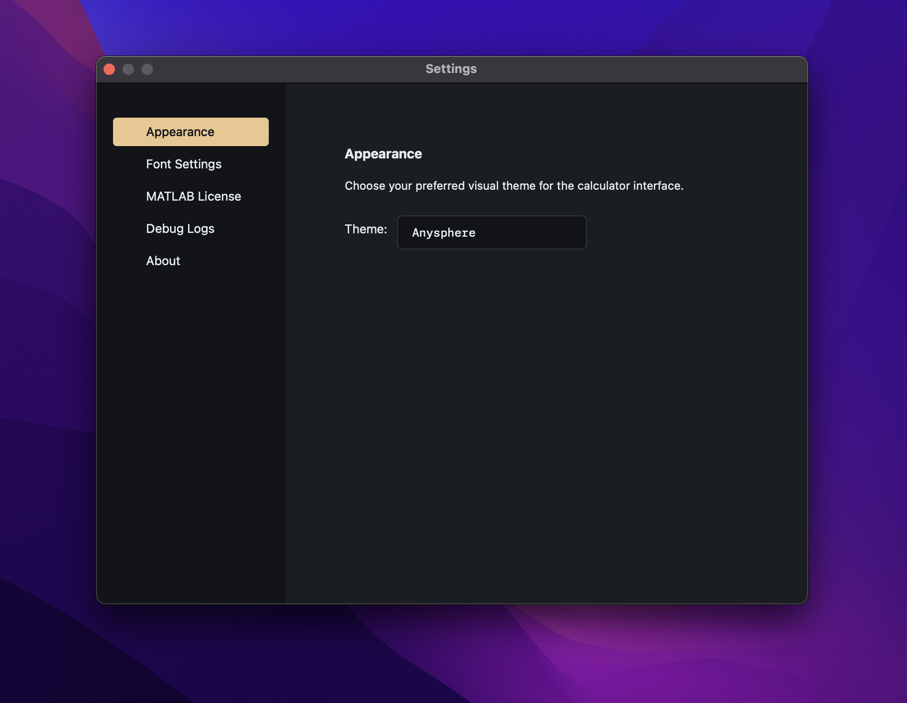

<div align="center">

# ⚡ VorTeX ⚡

> *Where Mathematics Converges*

Ever found yourself:  
Juggling between multiple math applications? 📱  
Wrestling with complex $\LaTeX$ syntax? ⚔️  
Hitting the limitations of basic calculators? 🚫  
Firing up MATLAB just for simple calculations? 💻

**VorTeX** brings them all together into one seamless experience.


### A Mathematical Vortex of Power

[](https://www.mathworks.com/products/matlab.html)
[](https://www.latex-project.org/)
[](https://www.riverbankcomputing.com/software/pyqt/)
[](https://www.manim.community/)

---

A powerful mathematical workbench that combines **MATLAB** and **SymPy**'s computational strength, **LaTeX**'s elegant notation, **PyQt5**'s sleek interface, and **Manim**'s stunning visualizations into one cohesive experience. *VorTeX* puts advanced tools for differentiation, integration, matrix operations, and symbolic computation right at your fingertips.

---

</div>

### Fresh New UI

We're excited to introduce our redesigned UI and new settings window!



Simply click the settings button when you launch the app to explore customization options for themes, fonts, and more.

### Enhanced Math Capabilities

Version 1.0.3 now handles multi-variable calculus with ease! Try expressions like:

```latex
\frac{\partial}{\partial x} \sin(x)\cos(y)
\frac{\partial^{2}}{\partial x \partial y} \sin(x)\cos(y)
```

Just type `pdx sin(x)*cos(y)`, and VorTeX will instantly give you the correct result: $\cos(x)\cos(y)$

We've also added differential equation solving! Enter something like:

```latex
\frac{d}{dx} y - 2y = 0
```

as `y'-2y=0`, and VorTeX will solve it for you: $y = C_{1}e^{2x}$.

Check out the simplified $\LaTeX$ input table below for more shortcuts.

### New Benchmark Results

We've added a comprehensive benchmark for our testing phase, and this version aced all the test cases! Want to see what we tested? Check out the [benchmark.md](benchmark/benchmark.md)!

## Features

- **$\LaTeX$ Input:** Express your math in simplified $\LaTeX$ format for clarity and ease.
- **MATLAB Integration:** Harness MATLAB's symbolic toolbox for powerful, precise computations.
- **Matrix Operations:** Easily calculate determinants, inverses, eigenvalues, and more.
- **SymPy Integration:** Enjoy symbolic computation even without MATLAB.
- **Theming:** Personalize your experience with multiple UI themes.
- **Logging:** Keep track of operations and troubleshoot with detailed logs.
- **Auto Simplify:** Get cleaner results with automatic expression simplification.
- **Manim Visualization:** See your math come to life with Manim visualizations (select functions supported).

## Getting Started

1. **Clone the Repository:**

   ```bash
   git clone https://github.com/Goge052215/VorTeX.git
   ```

2. **Install Dependencies:**

   Make sure you have MATLAB installed and the MATLAB Engine API for Python configured. Remember to add your MATLAB app (e.g., MATLABr2024b.app) to your PATH!

   ```bash
   pip install -r requirements.txt
   ```

   Don't have MATLAB? No problem! You can use our SymPy calculation module instead.

   Find the complete dependency list in [requirements.txt](requirements.txt)

3. **Launch VorTeX:**

   ```bash
   python main.py
   ```

## How to Use

1. **Choose Your Input Mode:**
   - **$\LaTeX$:** Perfect for symbolic computation with elegant notation.
   - **MATLAB:** Direct evaluation using familiar MATLAB syntax.
   - **Matrix:** Specialized tools for matrix operations.
   - **SymPy:** Simplified $\LaTeX$ expressions for non-MATLAB users.

2. **Set Your Angle Mode:**
   - **Degree:** When working with degrees in trigonometric functions.
   - **Radian:** For radian-based calculations.

3. **Enter Your Expression:**
   - Type your mathematical expression in the input field.

4. **Calculate:**
   - Hit the "Calculate" button to see the magic happen.

5. **View Your Result:**
   - Find your answer displayed below the calculate button.

6. **Visualize:**
   - Click "Visualize" to see your expression come to life.
   - The visualization will be processed by Manim and saved as an .mp4 file.

7. **Customize Settings:**
   - Access the settings window to personalize VorTeX and check debug logs.

## Example Expressions

- **Simplified $\LaTeX$ Mode, SymPy Mode:**
  - **Differentiation:** `d/dx (x^2)`, `d2/dx2 (x^2)`
  - **Integration:** `int e^(x) dx`, `int ln(x) dx`, `int x^2 dx`
  - **Trigonometric:** `sin(30)`, `cos(30)`, `tan(30)`

- **MATLAB Mode:**
  - **Differentiation:** `diff(x^2, x)`, `diff(x^2, x, 2)`
  - **Integration:** `int(exp(x), x)`, `int(ln(x), x)`, `int(x^2, x)`
  - **Trigonometric:** `sin(30)`, `cos(30)`, `tan(30)`

*Pro tip:* We recommend using simplified $\LaTeX$ input for the best experience. Here's a handy reference:

| $\LaTeX$ | Previous $\LaTeX$ Command | Simplified $\LaTeX$ Input |
| ------------- | ----------------------- | ----------------------- |
| $\displaystyle\frac{\text{d} }{\text{d}x}(f(x))$ | `\frac{d}{dx} (f(x))` | `d/dx (f(x))`  |
| $\displaystyle\frac{\text{d}^n}{\text{d}x^n}(f(x))$  | `\frac{d^n}{dx^n} (f(x))` | `dn/dxn (f(x))` |
| $\displaystyle\int e^{x} \text{d}x$ | `\int e^{x} dx` | `int e^x dx` |
| $\displaystyle\int_{a}^{b} f(x) \text{d}x$ | `\int_{a}^{b} f(x) dx` | `int (a to b) f(x) dx` |
| $\sin, \cos, \tan, \dots$ | `\sin, \cos, \tan, ...` | `sin, cos, tan, ...` |
| $\displaystyle\binom{n}{r}$ or $^n\text{C}_r$ | `\binom{n}{r}` | `binom(n, r) or nCr` |
| $\sqrt{x}$  | `\sqrt{x}` | `sqrt(x)` |
| $\|x\|$  | `\|x\|` | `abs(x)` |
| $\ln(x)$   | `\ln(x)` | `ln(x)` |
| $\log_{10}(x)$ | `\log_{10}(x)` | `log10(x)` |
| $\log_{n}(x)$  | `\log_{n}(x)`  | `logn(x)`  |
| $\alpha, \beta, \gamma, \dots$ | `\alpha, \beta, \gamma, ...` | `alpha, beta, gamma, ...` |
| $\displaystyle\sum_{i = a}^{b} f(x_i)$         | `\sum_{i = a}^{b} f(x_i)` | `sum (a to b) f(x)`      |
| $\displaystyle\prod_{i = a}^{b} f(x_i)$      | `\prod_{i = a}^{b} f(x_i)` | `prod (a to b) f(x)`     |
| $\displaystyle\lim_{x \to a} f(x)$         | `\lim_{x \to a} f(x)` | `lim (x to a) f(x)`      |
| $\displaystyle\lim_{x \to a^+} f(x)$       | `\lim_{x \to a^+} f(x)` | `lim (x to a+) f(x)`      |
| $\displaystyle\lim_{x \to a^-} f(x)$       | `\lim_{x \to a^-} f(x)` | `lim (x to a-) f(x)`      |
| $\pm\infty$       | `\pm\infty`    | `+infty` or `-infty`   |
| $\displaystyle \frac{\partial}{\partial x} f(x)$ | `\frac{\partial}{\partial x} f(x,y)` | `pdx f(x,y)` |
| $\displaystyle \frac{\partial^{2}}{\partial x \partial y} f(x)$ | `\frac{\partial^{2}}{\partial x \partial y} f(x,y)` | `pd2xy f(x,y)` |
| $\displaystyle \iint f(x,y) \text{d}x\text{d}y$ | `\iint f(x,y)\text{d}x\text{d}y` | `iint f(x,y) dxdy` |
| $\displaystyle \iiint f(x,y,z) \text{d}x\text{d}y\text{d}z$ | `\iiint f(x,y,z)\text{d}x\text{d}y\text{d}z` | `iint f(x,y) dxdy` |

For more shortcuts, check out [shortcut.py](latex_pack/shortcut.py)

### Examples in $\LaTeX$ Mode and SymPy Mode

1. `int 1/x dx` $\rightarrow$ $\displaystyle \int \frac{1}{x} \text{d}x = \ln(x)$
2. `int (1 to 3) x^3/(x^2 + 1) dx` $\rightarrow$ $\displaystyle \int_{1}^{3} \frac{x^3}{x^2 + 1} \text{d}x = 4 - \left(\frac{\ln 5}{2}\right)$
3. `d2/dx2 (4x^10)` $\rightarrow$ $\displaystyle \frac{\text{d}^2}{\text{d}x^2} (4x^{10}) = 360x^8$
4. `binom(5, 2) or 5C2` $\rightarrow$ $\displaystyle \binom{5}{2} = 10$
5. `tan(90) or tan(pi/2)` $\rightarrow$ $\tan(90) = \infty$
6. `sum (1 to 100) x` $\rightarrow$ $\displaystyle \sum_{i = 1}^{100} x = 5050$
7. `prod (2 to 10) ln(x)` $\rightarrow$ $\displaystyle \prod_{i = 2}^{10} \ln(x) = 62.321650$
8. `lim (x to 0) sin(x)/x` $\rightarrow$ $\displaystyle \lim_{x \to 0} \frac{\sin(x)}{x} = 1$

9.  `pdx sin(x)*cos(y)` $\rightarrow \cos(x)\cos(y)$

10. `y''+ 4y = 0` $\rightarrow C_{1} \cos(2x) + C_{2} \sin(2x)$

### Examples in Matrix Mode

1. (Determinant Mode) `[1 2; 3 4]`
```math
\begin{bmatrix}
   1 & 2 \\
   3 & 4
\end{bmatrix} = -2
```

2. (Inverse Mode) `[1 2; 3 4]`
```math
\begin{pmatrix}
   1 & 2 \\
   3 & 4
\end{pmatrix}^{-1} = \begin{pmatrix}
   -2 & 1 \\
   1.5 & -0.5
\end{pmatrix}
```
Output: `[[-2.0, 1.0], [1.5, -0.5]]`

3. (Eigenvalues Mode) `[1 2; 3 4]`
```math
\begin{pmatrix}
   1 & 2 \\
   3 & 4
\end{pmatrix} \rightarrow \begin{pmatrix}
   -0.37 & 0.00 \\
   0.00 & 5.37
\end{pmatrix}
```
Output: `[-0.37, 5.37]`

4. (Rank Mode) `[1 2; 3 4]`
```math
\begin{pmatrix}
   1 & 2 \\
   3 & 4
\end{pmatrix} = 2
```

## Troubleshooting

- **MATLAB Engine Not Starting:**
  - Double-check that MATLAB is properly installed.
  - Make sure the MATLAB Engine API for Python is correctly set up.
  - Verify your environment variables and MATLAB's path settings.

- **Output Errors:**
  - First, review your input for common mistakes like missing `dx` in integrals.
  - Check the debug logs in the settings page for more details.
  - Still stuck? Open an issue on our GitHub—we're here to help!

- **Invalid Expression Errors:**
  - Ensure your Simplified $\LaTeX$ or MATLAB expressions follow the correct format.
  - Verify that you're using supported functions and proper syntax.

- We'll continue adding troubleshooting tips as we identify common issues.

### Roadmap

#### Pure Math

- [X] Fixed limits handling
- [X] Fixed expression handling for $^n\text{C}_r, ^n\text{P}_r$
- [X] Fixed series evaluation
- [X] Added 2D plot Manim for functions
- [X] Added multivariable calculus calculation
- [X] Added differential equation solving
- [ ] Linear algebra module
- [ ] Number theory module

--------------------------------

#### Application modules

- [ ] Probability and modelling
- [ ] 2D plot Manim for calculus
- [ ] 3D demonstration Manim

## Contributing

We'd love your help making VorTeX even better! Feel free to open an issue or submit a pull request with enhancements or bug fixes.

## License

[MIT License](LICENSE)
